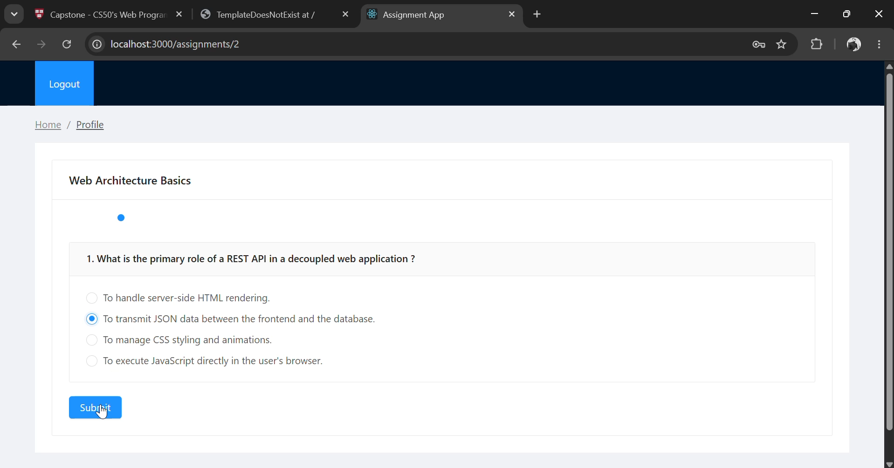
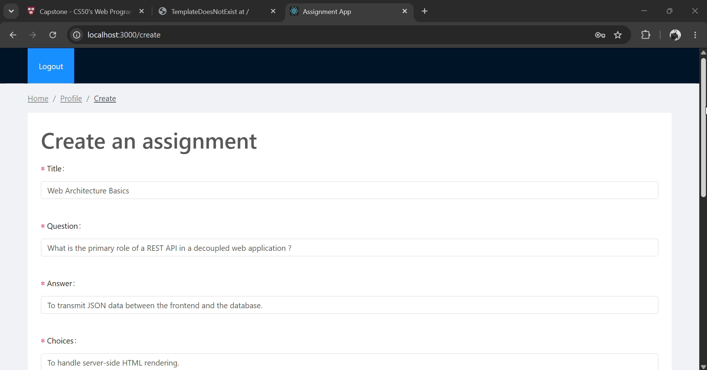

<div align="center">


</div>
   
## Overview
This project contains a Django REST API on the backend and a React application on the frontend. I call this the Assignment App. The platform allows users to sign up and log in to their accounts securely. Teachers can create interactive quizzes and assign choices along with the correct answers. Students can answer these quizzes and instantly view their results by navigating to their profile page. 

 <br>

## Distinctiveness and Complexity

### Distinctiveness
This capstone project is an advanced Educational Quiz & Assignment Platform built using a completely decoupled architecture: Django REST Framework (DRF) as a headless backend API and React with Redux as a Single Page Application (SPA) frontend.

 <br>

### Complexity
The technical complexity of this application spans across backend database logic and advanced frontend state management:
1. **Dynamic Database Schema:** The backend leverages Django models with complex relational mappings between Users, Students, Assignments, Questions, and Choices. Saving a single assignment requires nested data instantiation managed safely via customized serializers to avoid data inconsistencies.
2. **Automated Grading Algorithm:** The backend incorporates an automated grading engine inside the serialization layer. When a student submits their answers, the system fetches the assignment, isolates the correct choices, calculates the mathematical percentage score, and registers a locked `GradedAssignment` record.
3. **React & Redux Integration:** The frontend handles deep state tracking using Redux, Redux-Thunk, and Axios. User authentication states, assignment listings, and interactive forms are managed through a global store. 
4. **Mobile Responsiveness:** The user interface was designed with React JS and incorporates responsive design libraries (like Bootstrap and Ant Design) to ensure the web application works perfectly on mobile viewports.

## File Directory Map

Here is the complete breakdown of the application components and files designed for this project:

### Frontend Architecture (`src/`)
The frontend is built with React and Redux to display the landing page and allow users to interact with the application.

* **`src/components/`**:
    * `Choices.js`: Handles the radio buttons for the answer choices.
    * `Result.js`: Displays a visual progress bar and final percentage score after quiz submission.
* **`src/containers/`**:
    * `AssignmentCreate.js`: Complex dynamic form allowing teachers to create assignments and append questions.
    * `AssignmentDetail.js`: Renders a specific quiz layout for submitting assignments with user info and choices.
    * `AssignmentList.js`: Asynchronously fetches and displays the list of available quizzes.
    * `Layout.js`: Handles the main global UI layout of the web application.
    * `Login.js` / `Signup.js`: Handles user authentication and account creation.
    * `Profile.js`: Renders the student profile page where results are displayed.
    * `QuestionForm.js`: Handles the specific form where individual questions are created.
    * `Questions.js`: Manages the questions logic, allowing users to navigate and submit them.
* **`src/store/`**:
    * `actions/`: Contains action objects that hold the payload of information. Axios is used here to fetch and save data. These are the only sources of information for the Redux store.
    * `reducers/`: Contains functions that receive new values to update the application state based on the action type.
* **Core React Files (`src/`)**:
    * `App.js`: Contains the main subcomponents of the app.
    * `App.test.js`: A simple test file to check if the components render properly.
    * `index.js`: Renders the application and wraps it inside the necessary provider.
    * `routes.js`: Contains a collection of navigational components using React Router.

### Backend Architecture
The backend is the main Django app divided into logical folders.

* **Models (`users` and `api` folders)**:
    * `User`: A fully featured User model with admin-compliant permissions.
    * `Student`: Holds specific information for student profiles.
    * `Assignment`: Stores the main information for the quizzes.
    * `Question`: Holds the information about the questions within an assignment.
    * `Choice`: Stores the available choices for each question.
    * `GradedAssignment`: Holds the information about the submitted and graded assignments.
* **`api/views.py` & `api/serializers.py`**: These files contain the crucial logic. Views send and receive HTTP requests and interact with the client. Serializers validate the incoming data (quizzes) and deal with model instances.
* **`settings folder`**: The main configuration handling installed applications, middleware, databases, and CORS headers for cross-origin communication.
* **`urls files`**: Handles all the API endpoints and routing for the Django application.

## Installation & Execution Instructions

Run the application on their default ports (Django on `8000` and React on `3000`). Please run the backend first, then the frontend.

### 1. Backend Setup (Django)
1. Navigate to the project root directory.
2. Activate your virtual environment:
```
   source .venv/Scripts/activate 
   # or 'virtualenv env' depending on your OS configuration
```

3. Install dependencies and run the server:

```
   pip install -r requirements.txt
   python manage.py runserver
```
### 2. Frontend Setup (React)
1. Open a new terminal instance in the root directory.

2. Install the necessary node modules:

```
   npm i
```
3. Start the React development web server:

```
   npm start
```
### 3. For Production Deployment
To build the frontend for deployment, run:

```
npm run build
```
#### :copyright: Design and Development, Fortuné ADJAGBA

<a href="https://www.linkedin.com/in/sousso-esso-s-f-adjagba/">
  
</a>
<a href="https://twitter.com/adjagbafortune">
  
</a><br>  
